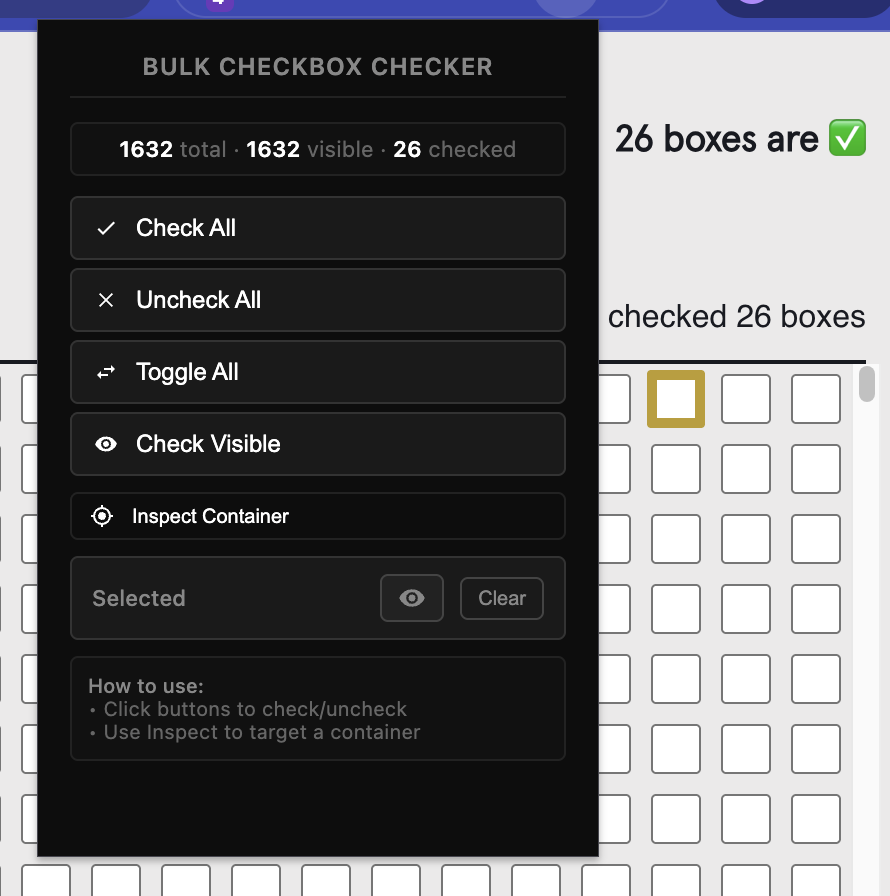

# Bulk Checkbox Checker

<p align="center">
  
</p>

**Bulk Checkbox Checker** is a powerful Chrome extension to instantly check, uncheck, or toggle all checkboxes on any webpage. Perfect for forms, surveys, task lists, and more.

---

## 🚀 Features

- **One-Click Operations:** Instantly check, uncheck, or toggle all checkboxes
- **Smart Visibility Detection:** Target only visible checkboxes
- **Inspect Mode:** Limit actions to a selected container
- **Real-Time Counter:** Live stats for total, visible, and checked boxes
- **Keyboard Shortcuts:** Fast actions without opening the popup
- **Visual Feedback:** Hover effects and success notifications
- **Universal Compatibility:** Works everywhere
- **Lightweight:** Minimal resource usage

---

## 🛠️ Installation

### Chrome Web Store
**Status:** Published 🟢
[Chrome Web Store](https://chromewebstore.google.com/detail/ioipmnpdkkoihnlfkcnlcbcmninfglbo?utm_source=item-share-cb)

### Manual Installation (Developer Mode)

1. **Clone this repository:**
   ```bash
   git clone https://github.com/Andyrei/bulk-checkbox-checker.git
   cd bulk-checkbox-checker
   ```
2. **Load in Chrome:**
   - Go to `chrome://extensions/`
   - Enable **Developer mode** (top right)
   - Click **Load unpacked**
   - Select the extension folder
   - The Bulk Checkbox Checker icon will appear in your toolbar

---

## ⚡ How to Use

### Popup Interface
1. Go to any webpage with checkboxes
2. Click the extension icon
3. View real-time checkbox stats
4. Choose your action:
   - **Check All**: Check all unchecked boxes
   - **Uncheck All**: Uncheck all checked boxes
   - **Toggle**: Flip the state of all boxes
   - **Click Visible**: Affect only visible checkboxes

### Inspect Mode
Target checkboxes in a specific section:
1. Click **Inspect** in the popup
2. Hover to highlight an element
3. Click to select a container
4. All actions now affect only that container
5. Click **Exit Inspect** or press `Esc` to exit

### Keyboard Shortcuts

- `Ctrl + Shift + C` — Check all checkboxes
- `Ctrl + Shift + U` — Uncheck all checkboxes
- `Ctrl + Shift + T` — Toggle all checkboxes

---

## 🎥 Demo Videos

**Basic Usage:**  
https://github.com/user-attachments/assets/65cab9f3-9fd0-4abf-953d-d9883de4678a

**Inspect Feature:**  
https://github.com/user-attachments/assets/03dc7a06-2b98-4a5f-bb65-de2b080c540b


## 💡 Usage Examples

- **E-commerce:** Select multiple products for comparison or checkout
- **Forms & Surveys:** Quickly select all options
- **Task Management:** Mark tasks as complete
- **Social Media:** Bulk select posts/messages
- **Cookie Policy Forms:** Uncheck/check all boxes easily


## 📁 File Structure

```
bulk-checkbox-checker/
├── manifest.json       # Extension configuration
├── popup.html          # Popup interface
├── popup.js            # Popup logic
├── content.js          # Content script
├── background.js       # Background service worker
├── cc-styles.css       # Styles
├── docs/
│   └── assets/         # Screenshots & demos
└── README.md           # This file
```


## 🔒 Permissions

- `activeTab` — Access the current tab
- `scripting` — Inject scripts into web pages


## 🌐 Browser Compatibility

- Chrome 88+
- Chromium-based browsers (Edge, Brave, etc.)


## 🔐 Privacy

- **No Data Collection:** No personal data is collected or stored
- **Local Processing:** All operations happen in your browser
- **No External Requests:** No communication with external servers


## 🧰 Tech Stack

- **Manifest V3** — Latest Chrome extension standard
- **Vanilla JavaScript** — No external dependencies


## 🛠️ Troubleshooting

**Extension not working?**
- Refresh the page after installing
- Check permissions for the current site
- Go to `chrome://extensions/` and reload

**No checkboxes detected?**
- The page might use custom checkbox elements
- Try refreshing the page
- Use Inspect Mode to select the correct container


## 🤝 Contributing

Contributions are welcome! Please submit a Pull Request.


## 📄 License

MIT License — see the [LICENSE](LICENSE) file for details.


## 🙋 Support

- **GitHub Issues:** Report bugs or request features
- **Email:** Contact information

---

> ⭐️ **If you find this extension helpful, please give it a star!**
